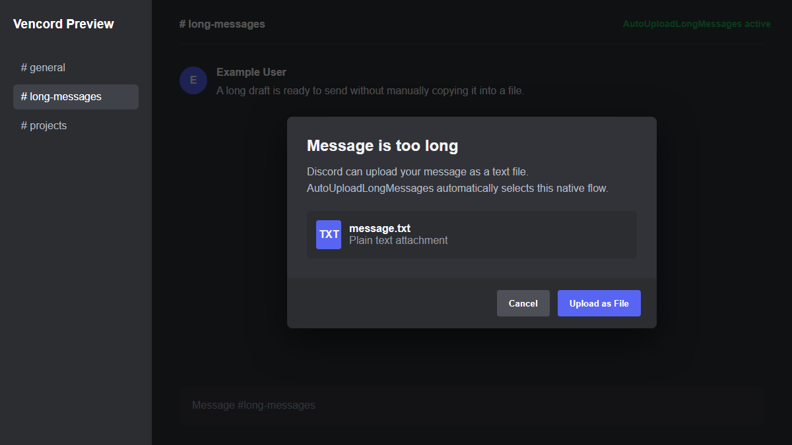

# AutoUploadLongMessages

[](https://github.com/eric99543/vencord-auto-upload-long-messages/releases/latest)
[](https://github.com/eric99543/vencord-auto-upload-long-messages/releases)
[](LICENSE)

A small Vencord userplugin that automatically chooses Discord's native `message.txt` upload flow when a message exceeds Discord's length limit.

It does not send messages through the Discord API. It activates the same upload option Discord already presents to the user.

> [!IMPORTANT]
> This is an unofficial userplugin for source-built Vencord. It is not supported by the Vencord project, and Discord updates may break its patch.

## Features

- Automatically selects Discord's native text-file upload option.
- Uses the current channel and Discord's existing upload UI.
- Makes no external network requests.
- Has no settings or background services.
- Prevents duplicate activation while an upload is being prepared.

## Screenshot



The plugin acts on Discord's oversized-message dialog and has no persistent interface of its own. The image above is a privacy-safe product preview; Discord wording may vary by client version.

## Install

### Download the plugin ZIP

1. Download [`autoUploadLongMessages.zip`](https://github.com/eric99543/vencord-auto-upload-long-messages/releases/latest/download/autoUploadLongMessages.zip).
2. Extract it into `<Vencord>/src/userplugins/`.
3. From the Vencord directory, run:

   ```shell
   pnpm build --disable-updater
   pnpm inject --branch stable
   ```

4. Restart Discord and enable **AutoUploadLongMessages** under **Settings > Vencord > Plugins**.

The extracted layout must be:

```text
Vencord/
└── src/
    └── userplugins/
        └── autoUploadLongMessages/
            └── index.ts
```

### Windows one-click installer

Download and double-click [`Install.bat`](https://github.com/eric99543/vencord-auto-upload-long-messages/releases/latest/download/Install.bat). It downloads the current PowerShell installer, installs the newest plugin release, rebuilds Vencord, reinjects Discord Stable, and starts Discord again.

If Windows warns about the downloaded file, review the source in [`scripts/Install.bat`](scripts/Install.bat) and choose **Run anyway** only if you trust it.

Alternatively, download [`Install.ps1`](https://github.com/eric99543/vencord-auto-upload-long-messages/releases/latest/download/Install.ps1) and run it from PowerShell:

```powershell
powershell -ExecutionPolicy Bypass -File .\Install.ps1
```

Both installers download the latest plugin ZIP, copy it into `Documents\Vencord`, rebuild Vencord with the official updater disabled, reinject Discord Stable, and start Discord again.

For a custom Vencord location:

```powershell
.\Install.ps1 -VencordPath "D:\Code\Vencord"
```

## Usage

Enable the plugin and send an oversized message normally. When Discord prepares its native `message.txt` choice, the plugin selects that flow automatically.

## Updating

Download the latest Release and repeat the installation. The Windows installer always downloads the newest published version.

## Compatibility

This plugin patches Discord internals. A successful Vencord build does not guarantee that the current Discord client still matches the patch. Please include Discord and Vencord versions in bug reports.

## License

[GPL-3.0-or-later](LICENSE), matching Vencord's licensing model.

## 繁體中文

AutoUploadLongMessages 是一個精簡的 Vencord 使用者插件。當訊息超過 Discord 字數限制時，它會自動選擇 Discord 原生的 `message.txt` 上傳流程。

插件不會透過 Discord API 直接傳送訊息，而是操作 Discord 原本就會顯示的上傳選項。

> [!IMPORTANT]
> 這是供自行編譯 Vencord 使用的非官方插件，並非由 Vencord 專案維護或提供支援。Discord 更新可能改變內部程式碼並使 patch 暫時失效。

### 功能

- 自動選擇 Discord 原生的文字檔上傳選項。
- 使用目前頻道與 Discord 現有的上傳介面。
- 不向外部服務發出網路請求。
- 沒有額外設定或背景服務。
- 準備上傳時會避免重複觸發。

### 預覽


插件只會在 Discord 的超長訊息對話框出現時執行，沒有常駐操作介面。上圖為不含私人資料的功能示意；實際文字可能因 Discord 用戶端版本而異。

### 安裝

#### 下載插件 ZIP

1. 下載 [`autoUploadLongMessages.zip`](https://github.com/eric99543/vencord-auto-upload-long-messages/releases/latest/download/autoUploadLongMessages.zip)。
2. 將 ZIP 解壓到 `<Vencord>/src/userplugins/`。
3. 在 Vencord 根目錄執行：

   ```shell
   pnpm build --disable-updater
   pnpm inject --branch stable
   ```

4. 重新啟動 Discord，前往 **設定 > Vencord > Plugins** 啟用 **AutoUploadLongMessages**。

解壓後的資料夾結構必須是：

```text
Vencord/
└── src/
    └── userplugins/
        └── autoUploadLongMessages/
            └── index.ts
```

#### Windows 一鍵安裝

下載並雙擊 [`Install.bat`](https://github.com/eric99543/vencord-auto-upload-long-messages/releases/latest/download/Install.bat)。它會下載目前版本的 PowerShell 安裝器、安裝最新插件、重新建置 Vencord、注入 Discord Stable，最後重新啟動 Discord。

如果 Windows 對下載檔案顯示警告，請先查看 [`scripts/Install.bat`](scripts/Install.bat) 原始碼；確認信任內容後再選擇繼續執行。

也可以下載 [`Install.ps1`](https://github.com/eric99543/vencord-auto-upload-long-messages/releases/latest/download/Install.ps1)，並在 PowerShell 執行：

```powershell
powershell -ExecutionPolicy Bypass -File .\Install.ps1
```

安裝器預設將插件複製到 `Documents\Vencord`，以停用官方更新器的方式重新建置 Vencord，注入 Discord Stable 並重新啟動 Discord。

如果 Vencord 位於其他位置：

```powershell
.\Install.ps1 -VencordPath "D:\Code\Vencord"
```

### 使用方式

啟用插件後照常傳送超過字數限制的訊息。當 Discord 準備顯示原生 `message.txt` 選項時，插件會自動選擇該流程。

### 更新

下載最新 Release 並重複安裝步驟即可。Windows 安裝器每次執行都會下載目前最新的已發布版本。

### 相容性

此插件會 patch Discord 內部程式碼。Vencord 成功建置不代表目前 Discord 用戶端仍符合 patch；回報問題時，請附上 Discord 與 Vencord 版本。

### 授權

本專案採用 [GPL-3.0-or-later](LICENSE) 授權，與 Vencord 的授權模式一致。
